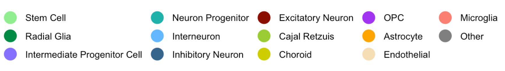

```{r setup, include=FALSE}
knitr::opts_chunk$set(echo = FALSE)
```

### Stem Cell Neural Differentiation Time-course

```{r, fig.show="hold", out.width="50%", fig.height= 3}

params$plotInoue
params$plotCORTECON
params$plotLIBD
params$plotMicali

```

\
\

### Organoid Time-course

```{r, fig.show="hold", out.width="50%", fig.height= 3, warning=F, message=F, echo=F}
params$plotBenitoOrganoid
params$plotPollenOrganoid
params$plotSloanOrganoid
params$plotKantonOrganoid
params$plotCampOrganoid
```

\
\

### Time-course Comparison

```{r,fig.width = 12, warning=F, echo=F, message=F}
params$plotComparison
```

\
\

### Regional Expression Embryonic Tissue

```{r,fig.show="hold", out.width="50%", fig.height= 8}

params$plotBrainSpan
params$plotAllen

```

\
\


### Cell Type Gene Differential Expression 

```{r,fig.show="hold", fig.width=12, fig.height= 6}
params$plotCombinedCell

```


\
\
